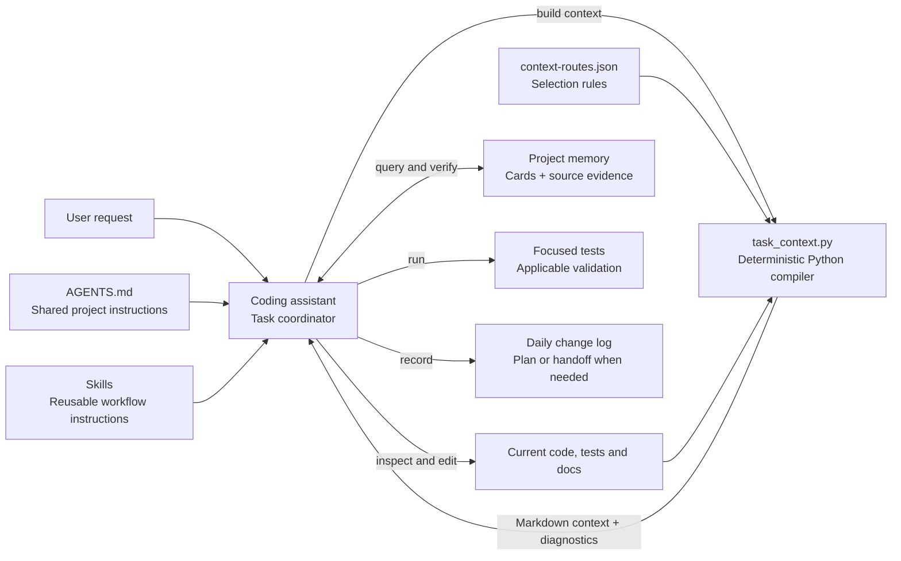
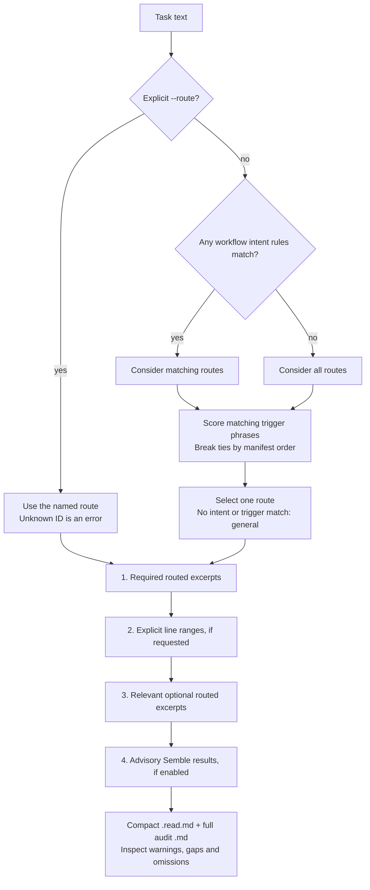
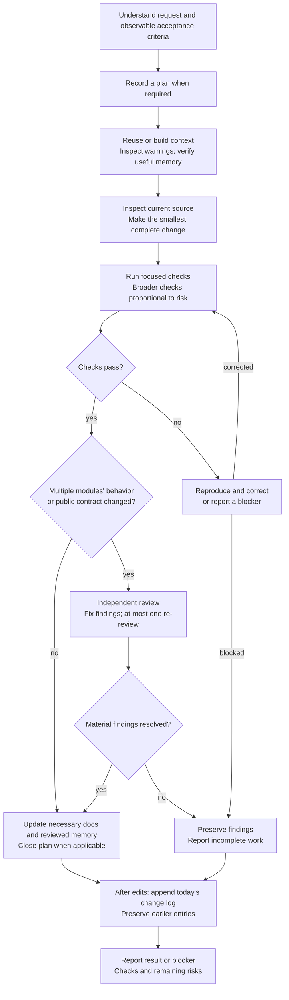
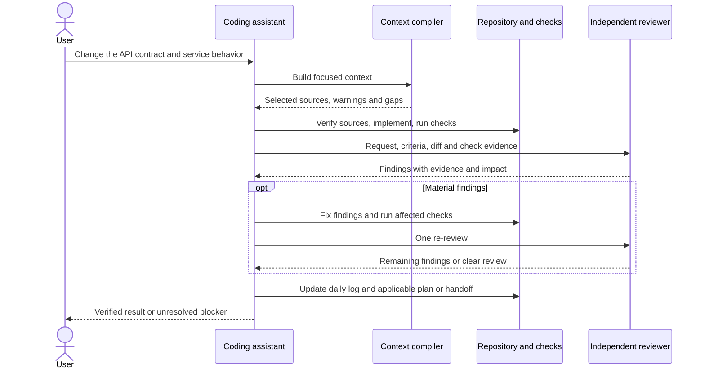

# Template Map

Architecture, routing, workflow, and coordination in kit **0.5.0**, checked
2026-09-23. Open this file in a Markdown viewer with Mermaid support to see the
drawings. Follow the source links for implementation details.

**The coding assistant coordinates the task.** The template supplies instructions,
context selection, skills, and checks. It has no always-running orchestration
service. A context route selects reading material; it does not select a model,
launch an agent, or execute a skill.

Quick reading: **request → assistant → focused context → work → checks → daily
summary → response**. Independent review is added when the change requires it.

## 1. Architecture: what talks to what?



The host, such as Codex or a supported Claude Code session, supplies the model,
tools, permissions, and any subagent capability. The kit supplies the project
workflow. Shared instructions do not imply identical skill discovery across hosts;
see [host compatibility](AGENTS_AND_SKILLS.md#claude-code-compatibility).

| Part | Where to inspect it |
| --- | --- |
| Shared instructions and completion rules | [AGENTS.md](../../AGENTS.md) |
| Routes and context compiler | [route manifest](context-routes.json), [compiler](../../scripts/task_context_engine.py) |
| Available workflows | [skills catalog](AGENTS_AND_SKILLS.md) |
| Memory lookup and evidence | [memory guide](MEMORY_RETRIEVAL.md) |
| Sample application's API/service/model layers | [application architecture](ARCHITECTURE.md) |

## 2. Routing: how is context chosen?



Multiple matching intents or tied best scores produce an ambiguity warning.
The compiler still chooses deterministically; the assistant inspects that choice
and can rerun with `--route`. Trigger matching is literal phrase logic, not a
model's understanding of arbitrary intent.

Every source passes containment, exclusion, secret-file, redaction, and budget
checks. Selection allows **10 distinct files and 40,000 excerpt characters**;
the compact reading view also caps its complete rendered output at 40,000
characters. Lower-priority content cannot displace required excerpts. Required
means priority, not guaranteed completeness: even required excerpts can be
missing or visibly truncated. If selected required/explicit reading content and diagnostics cannot fit,
compact rendering fails instead of silently dropping them.

The 13 routes include `bug-fix`, `api-endpoint`, `database-change`,
`frontend-change`, `refactor`, `planning-product`, `agent-system`,
`memory-maintenance`, `agent-setup`, `source-understanding`, `code-review`,
`architecture-decision`, and `general`.

Try the actual router from the project root:

```bash
python scripts/task_context.py explain "Review the API diff" --no-search
python scripts/task_context.py build "Fix the API regression" --route bug-fix --no-search
```

Builds read current sources; cached Markdown is never authoritative input.
Reuse an inspected bundle only while its task/options and relevant sources stay
current. For a missing fact, request `--expand-source PATH START END --reason
"why needed"`, supplying all desired ranges each time. Expansion is deliberate;
there is no automatic retrieval loop. Details: [context guide](CONTEXT_ROUTER.md).

## 3. Workflow: how does a change get finished?

A typical non-trivial change follows this path:



These arrows describe the assistant's workflow, not a Python state machine.
`safe-implementation`, `test-debug-loop`, `test-scope`, and `code-review` provide
instructions as relevant. The reference suite is capped at **49 collected cases**;
adopted projects choose their own budget. Read-only tasks need no daily entry.
Plans live in `.agent/plans/`; pause/resume checkpoints live in `.agent/tasks/`;
daily summaries live in `change_logs/YYYY-MM-DD.md` using the local date.

## 4. Coordination: who calls whom?

Example: a task changes an API contract and service behavior, so it needs review.



Use a separate agent/session for review when available; disclose review in the
same context otherwise. The host assistant starts and coordinates it. Skills are
instructions, not independent background workers.

Optional components have limited roles:

| Component | Role |
| --- | --- |
| Semble | Advisory source suggestions after routed and explicit context. |
| Serena / RTK | Symbol navigation / command-output compression when useful. |
| Opt-in hooks and rules | Lifecycle checks and command guardrails, not task scheduling. |
| Jev | Explicit shadow experiment: records advice; cannot choose execution routes, permissions, expansion, or completion. |
| Research evaluations | Explicit local runs or manual CI; live model runs require explicit flags. |

Routine CI runs the core tests, Python compilation, and asset validation.
Memory promotion stays manual. Optional experiments are described in the
[evaluation guide](RELIABILITY_EVALS.md); live effectiveness remains unmeasured.
